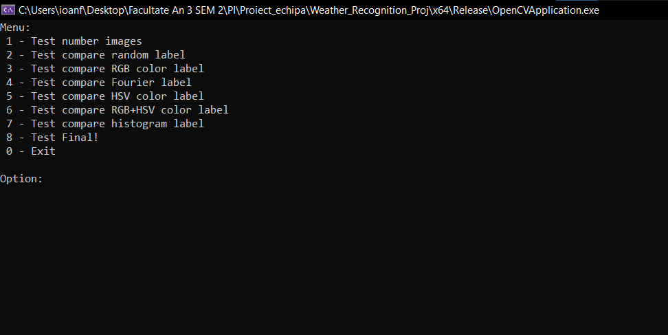

# Documentatie PI -- Weather Recognition --
## Introducere

Acest proiect este un clasificator de imagini pentru diferite tipuri de fenomene meteorologice, utilizand tehnici de procesare a imaginii și invatare automata. Proiectul foloseste biblioteca OpenCV pentru prelucrarea imaginilor si clasificarea acestora in una dintre cele 11 categorii: __'dew', 'fogsmog', 'frost', 'glaze', 'hail', 'lightning', 'rain', 'rainbow', 'rime', 'sandstorm', 'snow'__.

## Detalii implementare

### Struncturi :
- Pentru inceput am creat niste structuri in care sa ne memoram datele necesare:
    > Structura pentru memorarea imagini, path-ului pana la ea si eticheta asociata:

        struct ImageData {
	        Mat img;
	        std::string path;
	        int label;
        };

    > Structura pentru memorarea mediei culorii in RGB si in HSV pentru o categorie de imagini:

        struct MediiColori {
	        Scalar medieRGB;
	        Scalar medieHSV;
        };   

### Etichete:
 - 'dew' -> 0
 - 'fogsmog' -> 0
 - 'frost' -> 0
 - 'glaze' -> 0
 - 'hail' -> 0
 - 'lightning' -> 0
 - 'rain' -> 0
 - 'rainbow' -> 0
 - 'rime' -> 0
 - 'sandstorm' -> 0
 - 'snow' -> 0
 
### Citire imagini :
- Pentru citirea imaginilor am creat o functie __'traverseFolder'__ care parcurge recursiv un director si obtine path-urile fiecarei imagini.
- Odata ce am obtinut path-ul, ne folosim si de functia __'extractLabel'__ pentru a obtine eticheta originala a imagini respective, pe care o si memoram alaturi de imagine si path.
- Imaginile le impartim in 2, imagini de test si imagini de train. Pentru o divizare echitabila impartim imaginile cate una in fiecare parte.

### Etichete random :
- Pentru generarea etichetelor random am creat o functie care primeste o imagine, genereaza nu numar random din intervalul [0-10] si atribuie acest numar ca eticheta pentru noua imagine, pe care o si returneaza.
- Parcurgem un set de imagini si generam un alt set cu etichete generate random si le comparam intre ele pentru a obtine o acuraretea(verificam cat % din imagini au aceeasi eticheta cu cele originale).

### Media culorilor :
- Ne definim un vector de _"MediiColori"_. Apelam functia ___"calculMedieCuloriPerClasa"___ care primeste un set de imagini si calculeaza media culorilor in RGB si HSV pentru fiecare categorie. 
- In functia ___"generateSomethingLabel"___ trimit o imagine, vectorul cu medii si un cazul pe care vreau sa il aplic:
    - 1 -> compara in functie de mediile in RGB;
    - 2 -> compara in functie de mediile in HSV;
    - 3 -> tine cont de ambele medii, in RGB si HSV;
- Generez eticheta in functie de diferenta cea mai mica dintre media culorii imagini si mediile deja obtinute in functie de caz;

### Transformata Fourier :
- ___"calculateClassDescriptors"___ -> calculeaza descriptorii Fourier medii pentru fiecare clasa. Agrega descriptorii tuturor imaginilor din fiecare clasa si apoi calculeaza media lor.
- ___"fftshift"___ -> rearanjeaza cadranele unei imagini transformate Fourier astfel incat componentele de frecventa joasa sa fie centrate. Aceasta este utila pentru vizualizarea spectrului de frecvente.
- ___"computeFourierDescriptors"___ -> calculeaza descriptorii Fourier ai unei imagini. Parcurge mai multi pasi pentru a obtine reprezentarea in domeniul frecventei a imaginii si extrage descriptorii necesari.
    - Conversia imaginii in grayscale.
    - Padding-ul imaginii la dimensiuni optime pentru DFT.
    - Aplicarea DFT pentru a obtine reprezentarea in domeniul frecventei.
    - Rearanjarea coeficientilor DFT pentru a centra frecventele joase.
    - Calcularea magnitudinii DFT.
    - Extrage descriptorii Fourier si ii adauga in vectorul de descriptori.
- ___"generateFourierLabel"___ -> atribuie o eticheta unei imagini pe baza descriptorilor Fourier, comparandu-i cu descriptorii de clasa. Calculeaza distanta euclidiana intre descriptorii imaginii si cei ai claselor, atribuind eticheta clasei celei mai apropiate.
    - Verifica daca imaginea nu este goala.
    - Calculeaza descriptorii Fourier ai imaginii.
    - Calculeaza distanta euclidiana intre descriptorii imaginii si cei ai claselor.
    - Atribuie eticheta clasei cu cea mai mica distanta.

### Histograma de culori :
- ___"calculateClassHistograms"___ -> Calculeaza histogramele de culori medii pentru fiecare clasa, agregand histogramele tuturor imaginilor din fiecare clasa.
- ___"calculateColorHistogram"___ -> Calculeaza histograma de culori pentru o imagine, pe fiecare dintre cele trei canale (RGB). 
- ___"generateHistogramLabel"___ -> Atribuie o eticheta unei imagini pe baza histogramei de culori, comparandu-o cu histogramele de clasa.

### Combinare :
- La final am ales sa combinam toate categoriile pentru generarea si obtinerea unei acurateti cat mai bune.

### Program Principal :
- La proiect am lucrat in echipa, deci ne-am creat o logica care ne ia path-ul catre fisierul de imagini in functie de calculatorul de pe care se ruleza programul.
- Dupa am inceput prin a obtine imaginile si a calcula mediile culorilor, descriptori pentru tranformata Fourier si calcularea valorilor histogramei.
- Am creat un meniu pentru prezentarea rezultatelor:

## Rezultate obtinute :
In urma experimentelor am obtinut defierite valori pentru acuratere, unele cazuri au prezis mai bine, altele mai slab.
### 1. Test number images: 
- Am verificat daca numarul total de imagini ce se afla in folder este acelasi cu numarul de imagini ce le obtinem in vectori de train si test;

### 2. Test compare random label: 
- Am generat etichete random pentru imaginile de train si am comparat cu etichetele originale. 

    
    
    
    

- Aici se poate observa ca valorile difere de la rulare la rulare, rezultatele incadrandu-se intre 8%-10%.

### 3. Test compare RGB color label: 
- Aici am obtinut un nou vector cu imaginile care au etichetele noi gerenate pentru imaginile de test in functie de mediile culorii RGB. Am creat un tabel __("matrice de confuzie")__ care are pe coloane etichetele generate, iar pe linii cele originale. Diagonalele reprezinta imaginile care au etichetele egale si pe original si pentru generat.

- Am obtinut rezultate bune pentru _'lightning'_, _'rime'_, _'sandstorm'_, _'snow'_.
### 4. Test compare Fourier label:
- Pentru Fourier am facut acelasi lucru ca mai sus, doar ca am tinut cont de transformata Fourier.

- Acuratete mai slaba. 
- Rezultat foarte bun obtinut pentru _'fogsmog'_. 
### 5. Test compare HSV color label:
- Exact la fel ca la RGB, doar ca am tinut cont de media pe HSV.
 
- Acuratete mai buna.
- Rezultate buna la: _'dew', 'fogsmog', _'lightning'_, _'rime'_, _'sandstorm'_, _'snow'_._
### 6. Test compare RGB+HSV color label:
- Este o mica diferenta la valoare acuratetii fata de HSV.
 
### 7. Test compare histogram label:
- Aceeasi matrice de confuzie, dar pentru histograma de culori.
 
- Precizie buna pentru: _'glaze', 'frost'_.
### 8. Test Final!: 
- Aici am ales sa facem o combinatie intre toate experimentele, obtinand astfel o acuratete de peste 50%, ceea ce este foarte bine avand in vedere diversitatea de categorii de imagini.

## Observatii Finale:
- Metoda de clasificare bazata pe media culorilor poate fi eficienta pentru imagini cu diferente clare de culoare intre clase.
- Matricea de confuzie este utila pentru identificarea claselor care sunt frecvent confundate.
- Testele ofera o evaluare buna a performantei algoritmului si pot ghida imbunatatiri ulterioare.
- Pentru anumite categorii am reusit o precizie destul de buna, insa au fost si anumite clase care sunt greu de prezis, cum ar fi:
    - ___'hail'___:
    

        
        
        
    

    - ___'rain'___:
    

        
        
        
    

